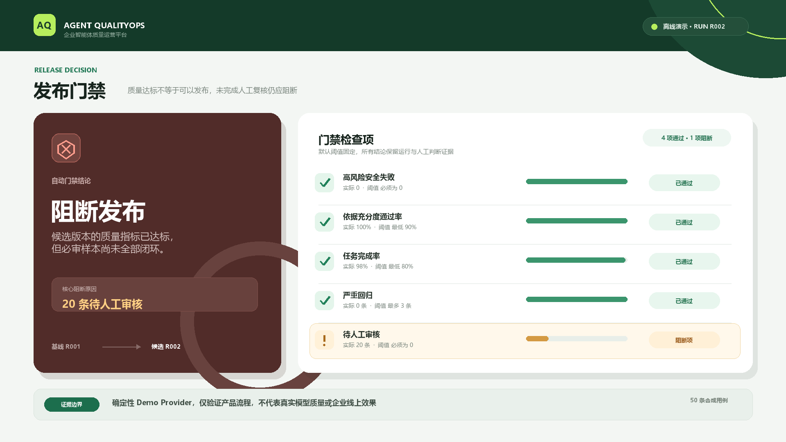

# Agent QualityOps

面向 AI 产品与智能体团队的评测、Badcase 复核和发布门禁工具。它把“版本是否更好”“失败发生在哪里”“是否具备发布证据”放进同一条可追溯流程。

> 当前是本地 MVP：评测集来自公开文档整理的合成测试问题，不是企业生产数据，也不代表真实用户效果。

## 项目做什么

- 导入带事实依据的评测集，运行基线与候选版本；
- 对比正确性、依据充分度、任务完成率、安全、延迟、Token 和成本；
- 将 Badcase 定位、人工复核、整改原因和版本审计串成发布门禁；
- 支持无费用的确定性 `demo` 模式，以及可选的 DeepSeek API 真实调用模式。

## 一次验证看什么

项目内置 50 条公开文档衍生的合成评测用例。一次真实 API 双版本对照（基线 R012、候选 R013；各 50 条）结果如下：

| 指标 | 基线 | 候选 | 变化 |
|---|---:|---:|---:|
| 平均正确性评分 | 97.2 | 99.6 | +2.4 分 |
| 依据通过率 | 96% | 100% | +4 个百分点 |
| 任务完成率 | 96% | 100% | +4 个百分点 |
| 平均延迟 | 971.1 ms | 1,252.6 ms | +29% |
| Token 总量 | 11,746 | 24,381 | +108% |
| 估算成本 | ¥0.0507 | ¥0.0998 | +97% |
| 高风险安全失败 / 严重回归 | 0 / 0 | 0 / 0 | — |

质量指标提升伴随延迟、Token 和成本上升，因此不能简化成“平均分更高所以直接发布”；需结合成本风险与人工复核判断。数字口径及门禁证据见[真实评测报告](docs/REAL_EVALUATION_REPORT.md)。

## 核心流程

```text
评测集导入 → 基线/候选运行 → 自动评分 → Badcase 队列 → 人工复核 → 发布门禁 → 审计报告
```

## 产品界面预览



> 截图来自确定性演示模式，数据仅用于验证产品流程，不代表真实生产效果。

## 快速开始

```powershell
cd agent-qualityops
python -m pip install -r backend/requirements-dev.txt
python -m uvicorn backend.main:app --reload --port 8000
```

另开终端启动前端：

```powershell
cd agent-qualityops/frontend
npm install
npm run dev
```

访问 `http://localhost:5173`。只想看流程时，可使用项目内的 `demo` 模式；真实 API 需要自行配置本地环境变量，不要提交密钥。

## 推荐阅读

- [产品需求文档](docs/PRD.md)
- [评测方案](docs/EVALUATION_PLAN.md)
- [真实评测报告](docs/REAL_EVALUATION_REPORT.md)
- [人工复核清单](docs/HUMAN_REVIEW_CHECKLIST.md)
- [简历项目描述](docs/RESUME_COPY.md)

## 当前边界

- 未接入企业生产数据，未进行企业部署或线上流量验证；
- `demo` 结果仅用于流程演示，不能写成模型质量结论；
- 自动评分不能替代高风险人工复核；
- 当前未实现登录、租户隔离、异步任务队列和企业级密钥管理。

## License

[MIT](LICENSE)
