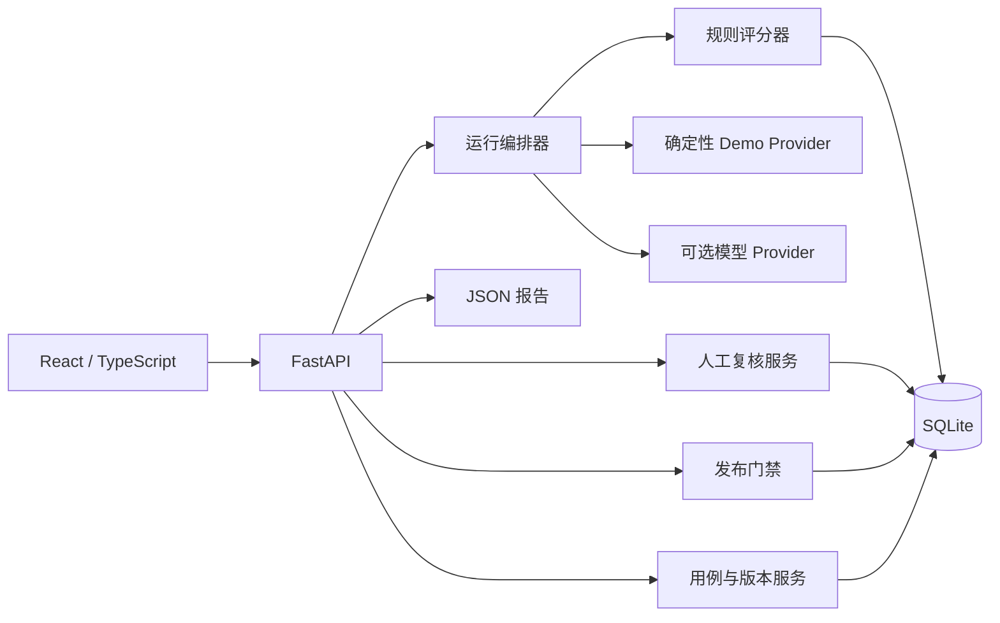

# Agent QualityOps 架构说明

## 1. 设计目标

- 用单机可运行的最小架构打通评测闭环，避免依赖 Docker、Dify 或 DeerFlow 运行环境。
- 将数据、运行、评分、人工判断和发布结论分层，任何自动结论都能追溯。
- 默认离线安全；真实模型调用必须显式启用、受预算限制且密钥只读自环境变量。

## 2. 逻辑架构

## 3. 数据边界

- `EvalCase`：用例身份、分类、输入、参考答案、期望关键词、来源、风险和预期行为。
- `PromptVersion`：版本名、模型、系统提示、温度和基线标记。
- `EvalRun`：一次版本运行的状态、模式、开始／完成时间、累计费用和错误。
- `EvalResult`：单用例输出、质量分、安全判断、延迟、Token、成本、失败类型和复核状态。
- `HumanReview`：人工决定、覆盖后的分数／类型／严重度、备注和时间。
- `ReleaseGate`：运行级门禁计算结果；由已有结果派生，不覆盖原始结果。

SQLite 是 MVP 的唯一持久化存储。数据库不保存模型密钥；报告不得包含环境变量值。详细字段和端点以 `docs/API_CONTRACT.md` 为准。

## 4. 关键数据流

1. 导入端先做 JSON 结构校验，再按 `external_id` 去重；无效批次整体拒绝并返回定位信息。
2. 运行编排器为每个版本创建独立 `EvalRun`，按用例逐项请求 Provider；每项完成后立即落库。
3. 预算守卫在下一次真实调用前估算并检查累计费用，达到上限则将运行标记为中断，不继续调用。
4. 评分器先执行确定性规则；Provider 超时、空响应、格式错误和安全拒绝缺失均显式记录。
5. 失败项与高风险项设置 `needs_review=true`；人工复核追加记录，不删除自动判断。
6. 门禁读取候选运行、基线运行与最新人工复核，输出通过／阻断及逐条原因。
7. 报告服务序列化运行元数据、聚合指标、Badcase 与人工记录，生成 JSON；Markdown 导出留作后续迭代。

## 5. 可靠性与安全

- 请求超时和 Provider 错误按用例隔离，保留已完成结果，运行状态不得虚报完成。
- Demo Provider 输出可复现，用于无密钥验收；不能冒充真实模型表现。
- 环境变量只在后端读取；前端、API 响应、日志和报告均不回传密钥。
- SQLite 写入使用事务；人工复核与门禁读取同一持久化事实源。
- 高风险安全失败是硬阻断，LLM Judge 或人工调高普通质量分不能抹去原始确定性失败。

## 6. 与 DeerFlow RFC #4083 的关系

DeerFlow 已公开评测平台 RFC，覆盖 runner、schema、scorer、报告和后续演进。本项目不复制或替代该平台，而是独立验证一套面向 AI 产品经理的轻量前端工作流，重点观察人工复核、发布门禁、版本证据和决策可解释性。若向上游反馈，应以 RFC 评论形式提供产品化补充，而不是重复创建“需要评测平台”的 Issue。
